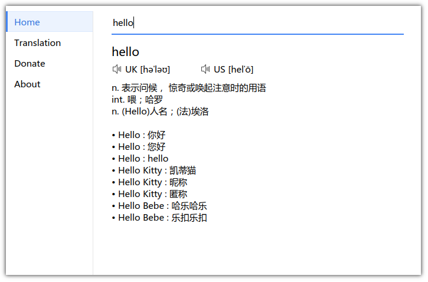

# Redict 

A chinese dictionary based on C++/Qt development.

## Build dependencies

`sudo apt install g++ qt5-default qtmultimedia5-dev libqt5svg5-dev`

## Installation

* mkdir build
* cd build
* qmake ..
* make

## Usage

`./redict`

## Build Debian Package

`dpkg-buildpackage -b -j`

## Build AppImage Package

`./build_appimage.sh`

[AppImageHub](https://appimage.github.io/Redict)

## Getting involved

We encourage you to report issues and contribute changes.

* [Translate for your language on Transifex](https://www.transifex.com/resoft/redict-1)

## License

Copyright © 2019 Unson Wong(Rekols)

This project is licensed under version 3 of the GNU General Public License.
